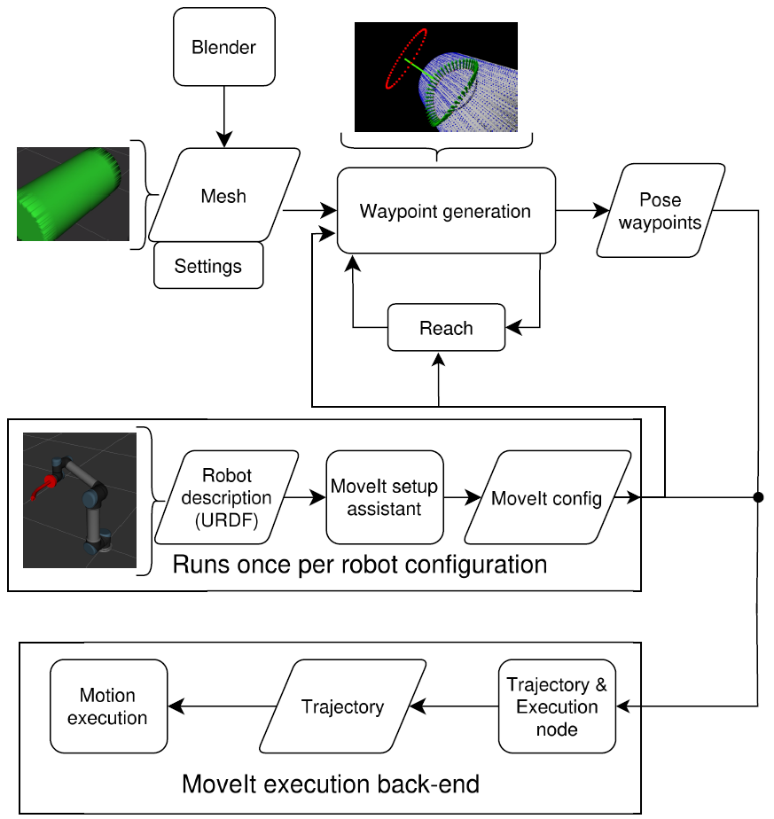
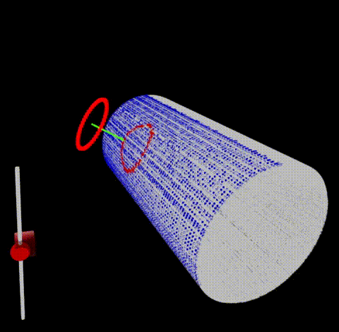
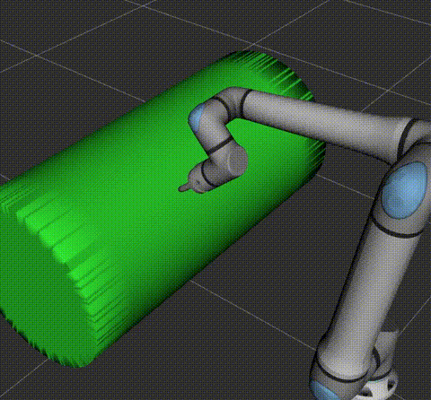

# Digital twin for validation of AI-based motion planning and control for robot-assisted processing of curved surfaces

## Summary
| Company Name | [ASG Robotics](https://asg-robotics.com) |
| :--- | :--- |
| Development Team Lead Name | [Karl Kruusamäe](https://www.etis.ee/CV/Karl_Kruusamae/eng) |
| Development Team Lead E-mail | [karl.kruusamae@ut.ee](mailto:karl.kruusamae@ut.ee) |
| Duration of the Demonstration Project | 09/2024-05/2925 |
| Final Report | [final_report.pdf](./files/final_report.pdf) |

# Description
## Objectives of the Demonstration Project

The primary goal of this project was to evaluate an open-source, modular software pipeline to enable surface-conforming Cartesian motion planning and execution, with a specific focus on robotic cutting and welding applications. The project aimed to create a digital twin of a robot-assisted process for curved surfaces, which could be used to test, validate, and benchmark motion planning algorithms. The tested digital twin pipeline seeks to bridge the gap between expensive, proprietary commercial systems and the more limited open-source alternatives by providing an integrated, robot-agnostic solution using the ROS 2 and MoveIt frameworks. A key objective was to create a platform that could facilitate the integration and testing of new AI-based motion planning algorithms, thereby supporting flexible manufacturing with parametric programming.

## Activities and Results of the Demonstration Project
### Challenge

The project addressed a significant challenge in manufacturing automation: the processing of complex, curved surfaces with robot manipulators, such as in milling and welding. Existing solutions are often proprietary, costly, and tied to specific hardware, creating a high barrier to entry for smaller companies and researchers. Open-source tools, while available, lacked a comprehensive, integrated, and geometry-aware pipeline for planning and executing trajectories on such surfaces. When automation is not feasible due to mathematical complexity or kinematic constraints, these tasks are performed manually by human workers. This project aimed to create an accessible, open-source solution to this problem. The initial challenge remained the central focus throughout the project.

### Data Sources

The technological solution utilizes a 3D model of the workpiece. In industrial applications, these models typically originate from Computer-Aided Design (CAD) files or 3D scans. For this demonstration project, the following specific data was used:

- 3D mesh models of pipe geometries created in Blender.
- Point cloud data with estimated surface normals, generated from the meshes using the Open3D library.
- Robot kinematic models (URDF descriptions) for the four validation platforms: Universal Robots UR5, UR20, Fanuc m10ia, and Kuka iiwa14.
- Motion execution data (joint states and end-effector poses) collected at 100 Hz during simulations for performance evaluation and benchmarking.

### AI Technologies
The project validated a digital twin and a motion planning pipeline designed to integrate, test, and benchmark various motion planning approaches, including future AI-based methods like diffusion policy and learning from demonstration. The project focused on creating and validating the essential infrastructure that enables the safe testing and deployment of novel AI algorithms. The pipeline leverages established robotics techniques such as inverse kinematics (IK) solvers, and the solution was validated and benchmarked using several of MoveIt's existing Cartesian motion planners:

- MoveIt Cartesian Interpolator (ComputeCartesianPath)
- Pilz Industrial Motion Planner
- MoveIt Servo

This framework provides the baseline for comparing these planners and future AI-based solutions in a standardized environment.

### Technological Results

The primary technological result of the project is a process-specific but universally scalable digital twin for robot-assisted processing of curved surfaces, along with a corresponding motion planning pipeline. The pipeline was rigorously validated in a simulation environment with the four distinct robot models. The evaluation benchmarked the performance of the three motion planning back-ends, with key findings showing a clear trade-off between accuracy, motion smoothness, and velocity control. For instance, the ComputeCartesianPath and Pilz planners demonstrated excellent path-tracking accuracy (sub-millimeter), while MoveIt Servo proved far superior in maintaining a consistent end-effector velocity, a critical factor for processes like welding.

### Technical Architecture

The system is architected as a modular ROS 2 pipeline. Its workflow is as follows:

- Input: The process starts with a 3D mesh of the workpiece and a 2D reference path (e.g., a circle defining the desired cut).
- Waypoint Generation: A core module projects the 2D reference path onto the 3D mesh surface using an efficient nearest-neighbor search.
- Feasibility Analysis: The generated 3D waypoints (poses) are checked for kinematic feasibility using the integrated Reach tool and a custom "Seed State Finder" algorithm.
- Trajectory Planning & Execution: The feasible poses are passed to a MoveIt execution back-end (e.g., ComputeCartesianPath, Pilz, or Servo) which plans the final trajectory and sends it to the robot's controllers.
- Visualization: The entire process, including the robot, the workpiece (as a collision object), and the executed path, is visualized using RViz.

### User Interface 

The system includes a graphical user interface (GUI) designed specifically for positioning the 2D reference path (the "stencil" for the cut or weld) in relation to the 3D workpiece model. This GUI allows the user to precisely place the contour and provides a live-updating preview of the final projected path on the object's surface. The primary interface for monitoring the overall process, including the robot's motion and environment, is RViz, the standard 3D visualization tool for ROS. The solution was validated as an experiment in a simulation environment.

  <figure style="text-align: center;">
    
    <figcaption>Path projection interface</figcaption>
  </figure>
  <figure style="text-align: center;">
    
    <figcaption>Robot monitoring in RViz</figcaption>
  </figure>

### Future Potential of the Technical Solution

While the project's primary focus was on robotic pipe cutting and welding, the framework is broadly applicable to any robotic task that requires an end-effector to precisely follow a path on a complex or curved surface.

- Milling
- Painting and Depainting
- Sandblasting
- Polishing
- Arc Welding
- Automated Quality Control and Inspection

### Lessons Learned

The project successfully solved the initial challenge by creating a functional, robot-agnostic, open-source pipeline for programming complex, surface-conforming robotic tasks like welding and cutting. This work effectively fills a documented gap in the open-source robotics toolset.

Key lessons learned from the project include:

- No One-Size-Fits-All Planner: The detailed benchmarking revealed a clear trade-off between different motion planning strategies. Planners like ComputeCartesianPath and Pilz provide superior path accuracy, which is crucial for precision milling, whereas MoveIt Servo excels at maintaining consistent velocity, a critical requirement for weld quality. This indicates that the choice of planner must be tailored to the specific application's most important constraints.
- The Importance of a Good Start: The custom-prepared "Seed State Finder" algorithm proved to be highly effective and almost essential for ensuring successful trajectory generation, reliably overcoming the non-deterministic behavior of some inverse kinematics solvers.
- Jerk vs. Accuracy: The smoothest motion, in terms of lowest jerk, was achieved by the ComputeCartesianPath back-end, which also had high accuracy. This suggests that for tasks sensitive to vibration, it is a strong candidate.
- Complexity of Integration: The project underscored that even with powerful frameworks like ROS 2 and MoveIt, significant, dedicated engineering effort is required to integrate components into a cohesive, validated, and user-friendly pipeline for advanced industrial applications.

